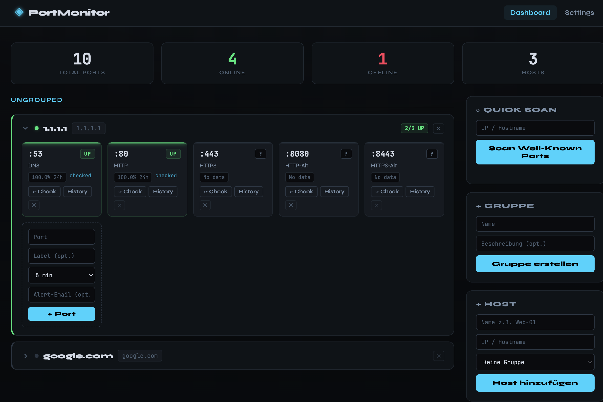

# ◈ PortMonitor

Ein leichtgewichtiger Port-Monitor für selbst-gehostete Setups.  
Gebaut mit Python (FastAPI) + htmx + SQLite. Läuft in einem einzigen Docker-Container.

## Features

- **Port-Checks** – TCP-Checks auf beliebige IPs/Hosts und Ports
- **Konfigurierbare Intervalle** – 1, 2, 5, 10, 15, 30 oder 60 Minuten
- **Check-History** – Letzte 200 Checks pro Port mit Timeline-Visualisierung
- **Uptime %** – 24h-Uptime-Prozent pro Port
- **Gruppen** – Hosts in Gruppen organisieren
- **E-Mail Alerts** – Benachrichtigung bei Port-Down/Up via SMTP
- **Manueller Check** – Per Klick sofort einen Check auslösen

## Schnellstart

```bash
# 1. Repository klonen / Dateien herunterladen

# 2. Starten
docker compose up -d

# 3. Öffnen
open http://localhost:8000
```

## Ressourcen

| Ressource | Verbrauch |
|-----------|-----------|
| RAM       | ~40–60 MB |
| CPU       | minimal   |
| Image     | ~80 MB    |
| Storage   | SQLite (wenige MB) |

Läuft problemlos auf dem kleinsten VPS (512 MB RAM).

## Konfiguration

### Ports ändern

```yaml
# docker-compose.yml
ports:
  - "80:8000"   # Port 80 statt 8000
```

### Daten-Pfad

Das SQLite-Datenbank-Volume wird automatisch als `portmonitor_data` angelegt.  
Manueller Pfad via Umgebungsvariable:

```yaml
environment:
  - DB_PATH=/data/portmonitor.db
```

### E-Mail Alerts

In der Web-UI unter **Settings** konfigurieren:
- SMTP Host, Port, User, Password
- Pro Port eine Alert-E-Mail hinterlegen

## Update

```bash
docker compose pull
docker compose up -d --build
```

## Screenshots



## Struktur

```
portmonitor/
├── main.py              # FastAPI App + Scheduler + Port-Check-Logik
├── requirements.txt
├── Dockerfile
├── docker-compose.yml
├── templates/
│   ├── dashboard.html
│   ├── history.html
│   └── settings.html
└── static/
    └── css/style.css
```
